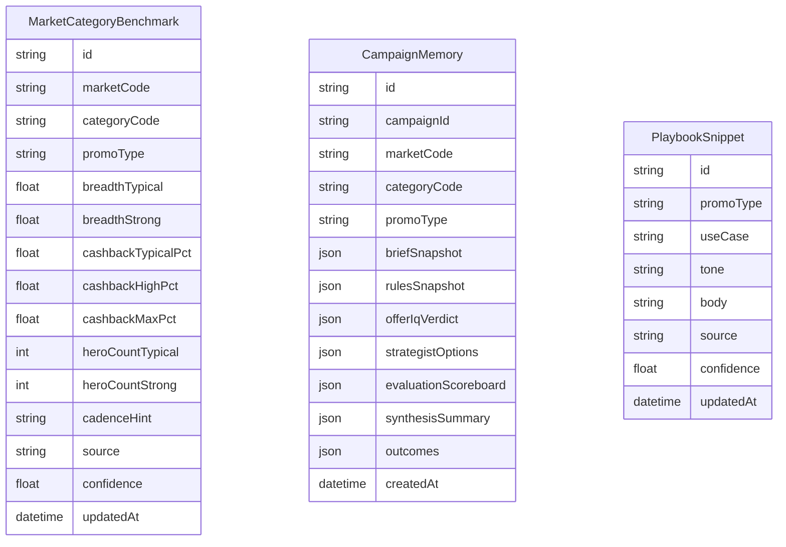

# Knowledge Grid Blueprint

## Purpose

Create a single intelligence layer that every orchestrator, rule engine, and research pipeline can query for authoritative guidance across campaign archetypes (instant win, cashback, draw, GWP, loyalty). The grid unifies benchmarks, heuristics, historical learnings, and guardrails so the system reasons like a global shopper marketing genius without per-campaign hacks.

## Core Pillars

1. **Benchmark Atlas**
   - Market × Category × PromoType metrics (cashback % bands, hero counts, breadth thresholds, cadence norms, friction tolerances).
   - Populated from Promotrack, OfferIQ diagnostics, curated research, and manual overrides.
   - Versioned entries with provenance (`source`, `confidence`, `lastValidated`).

2. **Campaign Memory & Founder Guidance**
   - Snapshot inputs and outcomes for every evaluated campaign (brief fields, rules, OfferIQ verdict, strategist options, final recommendation, post-launch metrics when available).
   - Founder Notes capture Mark’s principles and judgments (“2010 instant wins = generous”, “Cashback must feel like a hero lever”) and override generic heuristics where defined.
   - Enables pattern mining (“cashback < 8% rejected in AU appliances”, “hero overlay approvals linked to weekly cadence + POS proof”) while anchoring the system to the founder’s POV.

3. **Playbook Library**
   - Narrative fragments, copy patterns, and presentation templates keyed by archetype and outcome (“Instant 15% credit” phrasing, receipt-upload reassurance patterns).
   - Delivered as structured snippets with tone metadata (planner-grade prose, retail-ready bullet kit).

4. **Rule Engine Integration**
   - `CampaignRules` hydrates from the grid: e.g., `rules.benchmarks.cashback.typical`, `rules.guardrails.staff.zeroCapacity`, `rules.founder.principles`, `rules.presentation.copyBlocks`.
   - Orchestrators never embed static numbers or strings; they query the grid for decisions—and Founder Notes become hard constraints when present.

5. **Observability & Trust**
   - Every recommendation cites benchmark provenance.
   - Missing-data alerts surface when the grid lacks coverage, prompting manual curation instead of hallucination.

## Data Model (initial)

## System Flow (Phase 1)

1. **Ingestion**
   - Extend research pipeline to populate `MarketCategoryBenchmark` after each run.
   - Store manual overrides (curated by shopper planners) via WarRoom UI.
   - Persist orchestrator outputs into `CampaignMemory` and capture Founder Notes (CLI: `pnpm -C apps/backend exec tsx scripts/founder-note.ts ...`).
2. **Rules Hydration**
   - `buildCampaignRules` queries the Grid to enrich raw brief data.
   - Fallback logic uses heuristics when benchmarks are absent but raises TODO flags.
3. **Orchestrator Consumption**
   - Strategist/Evaluation/Synthesis request benchmark slices (`Grid.getBenchmarks(market, category, promoType)`).
   - Templates reference Playbook snippets (`Grid.getCopy('INSTANT_WIN', 'CadenceStatement')`).
4. **Feedback**
   - Post-launch upload endpoint writes outcomes back, closing the loop.

## Phased Implementation

1. **Phase 0 (In-Flight)**
   - CampaignRules refactor (completed).
   - Research localisation (completed).
2. **Phase 1 (Next)**
   - Scaffold Grid service (`lib/knowledge-grid.ts`), Prisma models, migration. ✅
   - Populate benchmark seed data (Promotrack export).
   - Hydrate CampaignRules with benchmark lookups. ✅
   - Add Founder Note model + ingestion; pipe into CampaignRules. ✅
   - Capture LLM research logs with provenance for audit/curation.
3. **Phase 2**
   - Persist campaign memory automatically after each orchestrator run.
   - Expose Playbook snippets via config + builder.
   - Surface LLM-sourced insights in UI with validation states.
4. **Phase 3**
   - Build analytics dashboards & alerts (missing benchmark coverage, guardrail breaches).
   - Train prompt selection using memory feedback.

## Immediate Tasks

1. Add Prisma schema for `MarketCategoryBenchmark`, `CampaignMemory`, `PlaybookSnippet`, `FounderNote`.
2. Implement `lib/knowledge-grid.ts` with cached reads + fallbacks.
3. Wire `buildCampaignRules` to fetch benchmark data and expose standardised knobs (`breadthStrongValue`, `cashbackTypicalPct`) and load Founder Notes.
4. Update Evaluation/Strategist templates to cite `CampaignRules.benchmarks` and founder guidance.
5. Schedule ingestion of existing Promotrack data into the Grid and seed Founder Notes for anchor campaigns.
6. Integrate LLM research pipeline outputs into the Grid with provenance + confidence tags.
